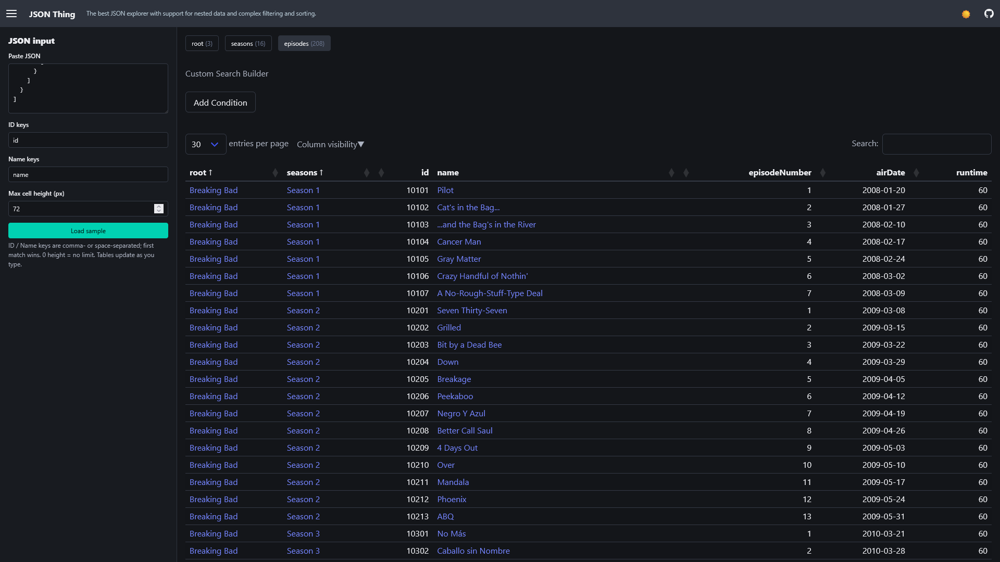

# [JSON Thing](https://jsonthing.com)

## Overview

JSON Thing is a web based JSON viewer that turns JSON files into easily navigatable
tables with advanced filtering and sorting options.

## Key Features
- **Nested tables**: Every array becomes a seperate table that the user can easily
  navigate between.
- **View all cousins (nodes at the same level) in a single table**: You can view all of
  the episodes for all of the different TV shows in a single table.
- **Advanced filtering and sorting**: 
   - Unlimited number of filters/sorts.
   - Per column or global filtering.
   - Advanced filtering options such as:
      - Is less than
      - Is greater than
      - Is between,
      - Contains
      - Does not contain
      - Is empty,
      - Is not empty
      - Etc.
   - Configurable automatic column faceting.
- **Fully client side**: Your data is secure. The only network requests made are the
  ones required to load the initial webpage.
- **Details view**: Easily see all of the information for a row in a list so you don't
  have to constantly be scrolling to read everything.

## Why

Existing tools lacked the ability to easily navigate large nested JSON structures. JSON
Thing's usage of linked tables makes it feel like you are using a custom made admin
interface instead of a single table/list/graph that quickly becomes complex and
impossible to navigate.

# Technology Used

- **[DataTables](https://datatables.net)**
- **[Bulma](https://bulma.io)**
- **[GitHub Pages](https://pages.github.com)**

